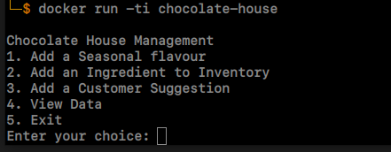
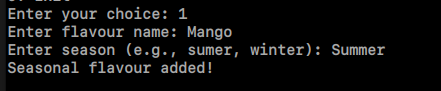
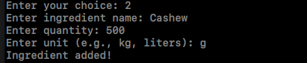
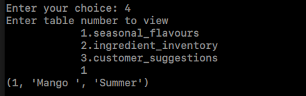

# Chocolate House
---
This assignment is a part of the L7 informatics placement at Sir MVIT. <br>
This project was written in a Ubuntu Based Distro. <br>

The project is in the hierarchy 
```
chocolate-house
│   README.md
│   Dockerfile
└─── src
      |    requirements.txt
      └─── app.py
```

## Execution
### 1. Clone the Repository
	git clone https://github.com/ch374nvj/chocolate-house.git
### 2. Open the cloned repo
	cd chocolate-house
### 3. Build Docker image
	docker build -t chocolate-house ./
### 4. Run app in Docker
	docker run -ti chocolate-house

## Demo
### 1. Main Menu
 <br>
It consists of 4 operations to perform, and last option to exit the application.

### 2. Operations
 <br>
 <br>
The menu operations can be performed by entering the Menu id.

### 3. View Data
 <br>
The Application makes use of sqlite database. The data entered into the db can be viewed as a tuple output.

# Credits
### Author: Chetan Vinayaka J
### USN:    1MV21EC039
